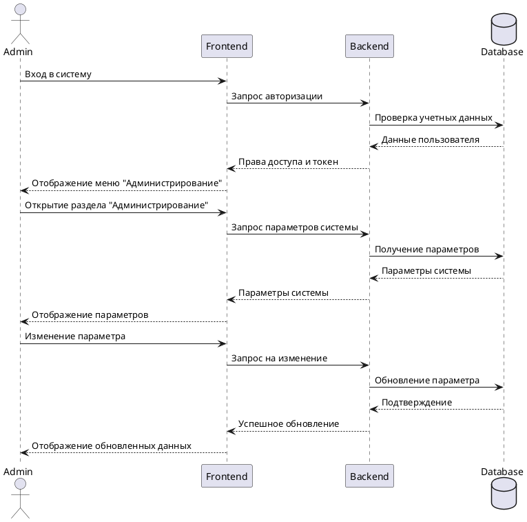

> [!Общее]-
up:: 
created:: 2024-08-05
updated:: `= this.file.mday`
accociations:: 

context:: В рамках проведенного ранее исследования была описана ситуация с .... В результате было предложено одно из возможных решений для предотвращения ситуации, когда .... Данное решение выражается в необходимости создания функциональности, которая позволит ....
title:: Панель администрирования
## Я как `role` хочу `want` для того, чтобы `objective`
role:: администратор системы
want:: чтобы в GUI приложения раздел администрирования
objective:: доступ к административным функциям был под рукой
## Реализация
task:: mytask-123
parent:: 
status:: 7-готово
version:: 1.0.0
knowledge:: [Постановка задачи в вики](https://my-wiki/12345)
## Реализуемые требования
```dataview
TABLE requirement as Требование, applications as "⚙ 👍", votes as "👤 👍", fr as "Функц. требование", ac as "Критерии приёмки", implementation as "Где реализовано", status as Состояние
FROM "Требования"
WHERE startswith(file.name, "req.") AND (contains(implementation, this.file.name) OR contains(implementation, this.file.link))
SORT file.name ASC
```

## Допущения и ограничения

| №   | Описание                                         |
| --- | ------------------------------------------------ |
| 1   | Делаем независимую аутентификацию  и авторизацию |
| 2   |                                                  |
## Связанные документы

- Задача **`= "[" + this.task + "](https://my-task-tracker/tasks/task/" + this.task + ")"`**
- Вики: `= this.knowledge`
- REST API: [спецификация OpenAPI]()

## Прототипы пользовательских интерфейсов
### Готовые прототипы
Макет подготовлен: [Текущий макет]()
### Концептуальные прототипы
Концептуальные прототипы, отражающие содержание, **но не форму** страниц панели администрирования.
**НЕ** для использования в качестве макетов.

![[Pasted image 20241221191929.png]]

## Описание
Необходимо реализовать панель администрирования с двухуровневой системой ролей (администратор и суперадминистратор). Панель должна позволять управлять параметрами системы и администраторами. Доступ к панели осуществляется через дополнительное меню в основном интерфейсе. Администраторы могут просматривать и изменять параметры системы, а суперадминистраторы дополнительно могут управлять учетными записями администраторов.

Общий порядок взаимодействия:



## Комментарии для разработки/тестирования

### Общие
Описание REST API полностью готово, так что разработку бэкенда и фронтенда можно вести одновременню
### Бэкенд

Для реализации панели администрирования необходимо сделать на бэкенде следующее:
1. Создать модели данных для хранения параметров системы
2. Создать модель для ролей пользователей (admin, superadmin)
3. Разработать REST API:
	- GET /api/admin/parameters - получение всех параметров
	- PUT /api/admin/parameters/{id} - обновление параметра
	- GET /api/admin/users - получение списка администраторов
	- POST /api/admin/users - создание нового администратора
	- DELETE /api/admin/users/{id} - удаление администратора

### Фронтенд

Для реализации панели администрирования необходимо сделать на фронтенде:
1. Добавить пункт меню "Администрирование" в основное меню
2. Создать компоненты:
	- Страница администрирования
	- Форма редактирования параметров
	- Таблица параметров системы
	- Компонент управления администраторами
1. Реализовать сервисы для работы с API:
	- Получение параметров
	- Обновление параметров
	- Управление администраторами
2. Добавить роутинг для новых страниц
3. Реализовать проверку прав доступа на клиенте
4. Добавить обработку ошибок и уведомления

# `= this.title`
==Копипастить отсюда Копипастить отсюда Копипастить отсюда Копипастить отсюда Копипастить отсюда==

## Пользовательская история

| **Я как**           | `= this.role`      |
| ------------------- | ------------------ |
| **Хочу**            | `= this.want`      |
| **Для того, чтобы** | `= this.objective` |
|                     |                    |
## Контекст
`=this.context`

![[#Допущения и ограничения]]
![[#Связанные документы]]
![[#Прототипы пользовательских интерфейсов]]
## Реализуемые требования
```dataview
TABLE WITHOUT ID file.name as "Код", fr as "Функциональное требование", ac as "Критерии приёмки"
FROM "Требования"
WHERE startswith(file.name, "req.") AND (contains(implementation, this.file.name) OR contains(implementation, this.file.link))
SORT file.name DESC
```
![[#Описание]]
![[#Комментарии для разработки/тестирования]]
